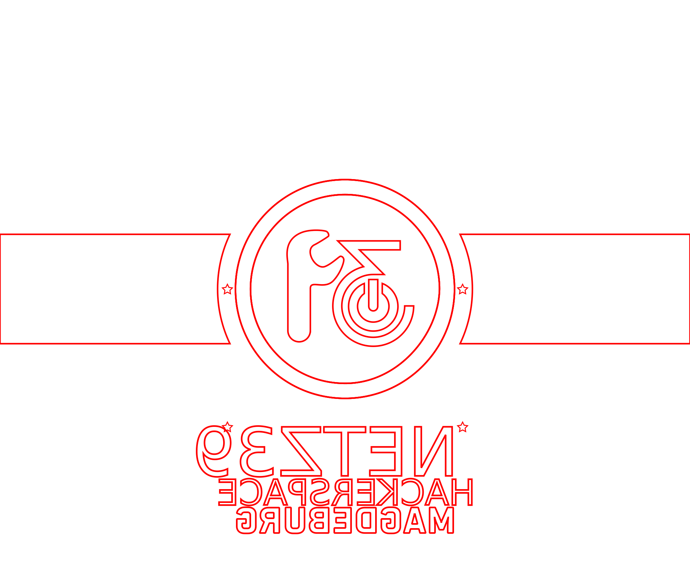
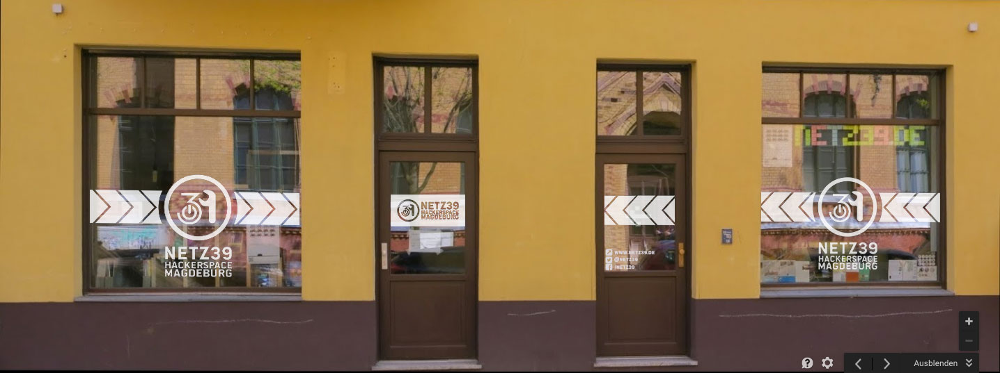

# n39schaufenster
Eine möglichst repräsentative Folienbeschriftung des N39 Schaufensters

*Folgende simulierte Bilder sind nur annähernd maßstabsgetreu und garantiert nicht korrekt zur Perspektive eingefügt.*
## NoTags
In diesem Entwurf sind die Quer-Balken einfache Balken ohne Beschriftung oder Muster

### Endausrichtung

### Vorlage zum effizientem Plotten:

## Pointers

